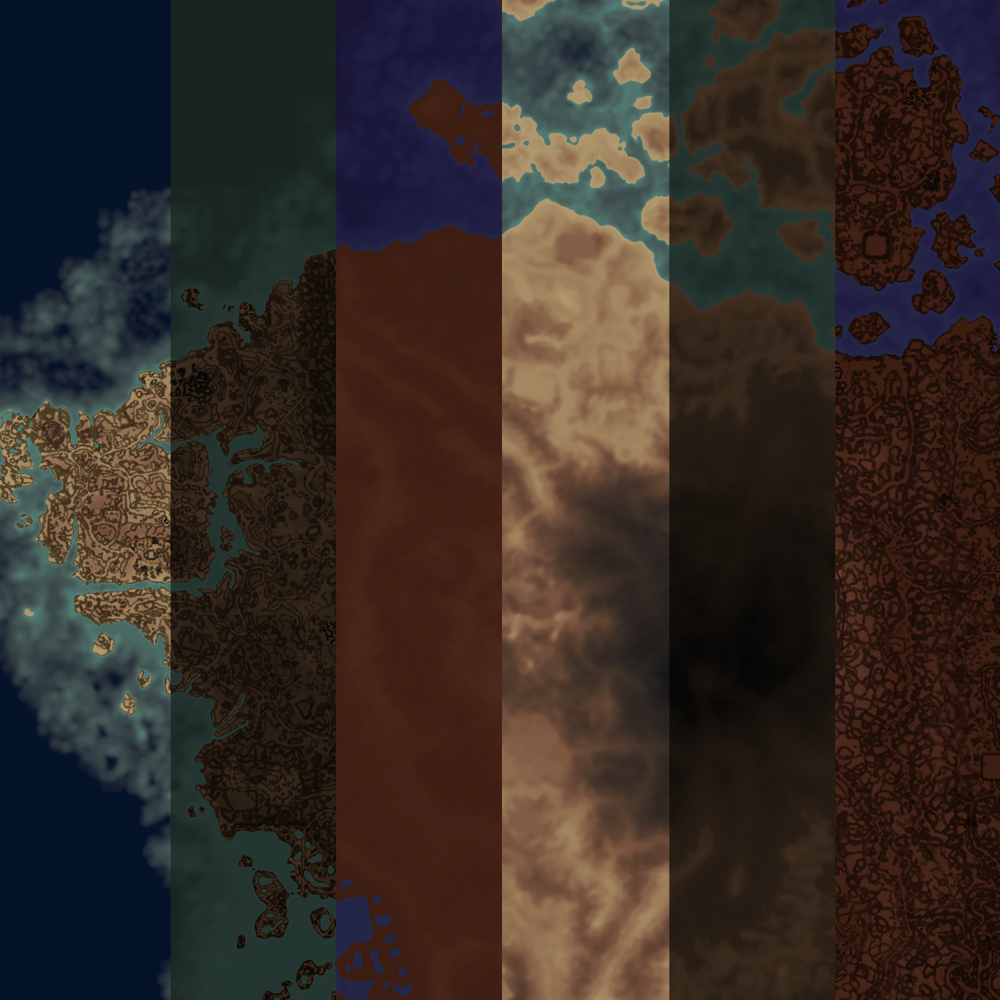

# LivelyMap

Overworld map replacer for openmw. Rendered in 3D (with the help of parallax shaders). Track and show your historic path through the game. Use custom stamp markers or also rely on automatic markers.

## Installing the mod

First set up the data folders and plugin. Then run the sync tool. *This order matters.*

### Data Folders and Plugin

There are *Data Folders* in this folder that you need to add to your `openmw.cfg`.
These all have numbers as prefixes. At a minimum, you need to add `00 Core` and one of the `01 ****` folders. Don't add more than one folder with the same number, they are exclusive.

You also need to add `00 Core/LivelyMap.omwaddon` as a plugin to `openmw.cfg`.
Don't add `LivelyMap.omwscripts` if you see it.

### Run the Sync Tool

1. Install Go: https://go.dev/doc/install
1. Run `sync.sh <location of my openmw.cfg>` or `sync.bat <location of my openmw.cfg>`.

This will generate all the required textures and metadata from your install.
It will also extract path data from your saved games.

You can specify a custom ramp file with the `-ramp="myrampfile.bmp"` argument. This should be a 1x512 resolution file, with the midpoint representing the water level. You'll need to modify the sync script to include this argument.

## Updating the mod

Make sure `cmd/lively/lively` or `cmd/lively/lively.exe` are deleted after you pull in the new files. This is the binary that is built when you run the sync script.

## Using the map

Configure a key to bring the map up. You do this in the in-game mod settings. Then press that key to bring the map up. Press it again to take the map down (or press Escape or try to bring up your inventory or journal).

To *pan the map*: click, or click and drag, or use your arrow keys, or use your D-pad.

There are buttons in a bar at the top of the map. These do extra stuff.

### Parallax Shader Calibration

If you are using a parallax shader and either `02 Normals` or `02 Extreme Normals`, the map will appear 3-dimensional! This is cool, but you will need to calibrate the vertical offset or icons will appear to float as you pan around. In the mod settings, enable *Parallax Calibration Mode*, then bring up the map. This adds three buttons to the top bar. The *-* reduces the offset width, and *+* increases it. The *down-arrow-into-a-bucket* toggles between only allowing icons to be pushed down into the mesh or if the offset width should be equally distributed between the top and bottom of the mesh. This is determined by how your shader is handling parallax offsets. When you're done, turn calibration mode off in your settings.

## FAQ

*Why is the map pink?* You either didn't run the sync tool, or the sync tool failed.

*Why are the icons so floaty?* You are using a parallax shader but haven't followed the Parallax Shader Calibration steps.

*Why is my save file so big?* You might have a lot of path data saved in it. Run the sync tool to extract the path data from your save. The data will be moved into a json file under `00 Core/scripts/LivelyMap/data/paths`.

*Why am I getting out of memory errors when running the sync file?* Edit the sync file and change `-threads=#` to `-threads=1` and try again.
